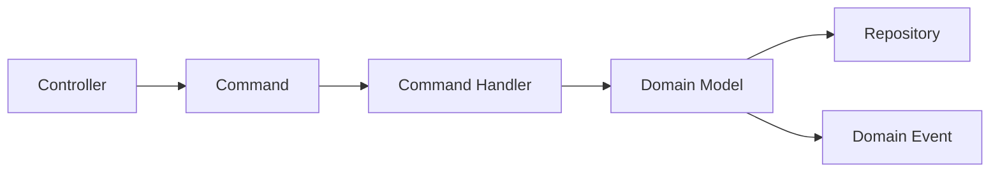
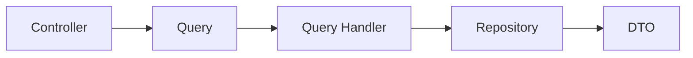

# Modules Layer

Modules katmanı, uygulamanın iş mantığını modüler bir şekilde organize eden katmandır. Her bir modül kendi içinde bağımsız ve kendi sorumluluğuna sahiptir.

## 📁 Klasör Yapısı

```
modules/
├── product/           # Örnek bir modül
│   ├── commands/     # Command sınıfları
│   ├── queries/      # Query sınıfları
│   ├── handlers/     # Command ve Query handler'ları
│   ├── controllers/  # HTTP endpoint'leri
│   ├── dtos/        # Data Transfer Objects
│   └── events/       # Module-specific events
├── order/            # Başka bir modül örneği
└── user/             # Başka bir modül örneği
```

## 🏗️ Modül Yapısı

Her modül aşağıdaki yapıyı takip eder:

### 1. Module Definition
```typescript
@Module({
    imports: [
        CqrsModule,
        TypeOrmModule.forFeature([ProductEntity])
    ],
    controllers: [ProductController],
    providers: [
        ...CommandHandlers,
        ...QueryHandlers,
        ...EventHandlers
    ]
})
export class ProductModule {}
```

### 2. Commands
```typescript
export class CreateProductCommand extends BaseCommand {
    constructor(
        public readonly name: string,
        public readonly price: number
    ) {
        super();
    }
}
```

### 3. Queries
```typescript
export class GetProductQuery extends BaseQuery {
    constructor(
        public readonly id: string
    ) {
        super();
    }
}
```

### 4. DTOs
```typescript
export class CreateProductDto {
    @IsString()
    @MinLength(3)
    name: string;

    @IsNumber()
    @Min(0)
    price: number;
}
```

### 5. Controllers
```typescript
@Controller('products')
export class ProductController {
    constructor(
        private readonly commandBus: CommandBus,
        private readonly queryBus: QueryBus
    ) {}

    @Post()
    async create(@Body() dto: CreateProductDto) {
        const command = new CreateProductCommand(dto.name, dto.price);
        return this.commandBus.execute(command);
    }
}
```

## 🔄 CQRS Flow

1. **Command Flow**


2. **Query Flow**


## 📝 Module Guidelines

### 1. Module Boundaries
- Her modül kendi bounded context'ine sahip olmalı
- Modüller arası bağımlılıklar minimize edilmeli
- Modüller arası iletişim event'ler üzerinden yapılmalı

### 2. Command/Query Separation
- Command'ler state değişikliği yapmalı
- Query'ler sadece veri okumalı
- Command'ler void veya id dönmeli
- Query'ler DTO dönmeli

### 3. Validation
```typescript
export class UpdateProductDto {
    @IsOptional()
    @IsString()
    @MinLength(3)
    name?: string;

    @IsOptional()
    @IsNumber()
    @Min(0)
    price?: number;

    @IsOptional()
    @IsBoolean()
    isActive?: boolean;
}
```

### 4. Error Handling
```typescript
@Controller('products')
export class ProductController {
    @Get(':id')
    async getProduct(@Param('id') id: string) {
        try {
            const query = new GetProductQuery(id);
            return await this.queryBus.execute(query);
        } catch (error) {
            if (error instanceof NotFoundException) {
                throw new HttpException('Product not found', HttpStatus.NOT_FOUND);
            }
            throw error;
        }
    }
}
```

## 🔍 Testing

### 1. Unit Tests
```typescript
describe('CreateProductHandler', () => {
    it('should create a product', async () => {
        // Test implementation
    });
});
```

### 2. Integration Tests
```typescript
describe('ProductController (e2e)', () => {
    it('/products (POST)', () => {
        // Test implementation
    });
});
```

## 📊 Monitoring & Metrics

Her modül için:
- Request/Response metrics
- Business metrics
- Error rates
- Performance metrics

## 🔒 Security

### 1. Authorization
```typescript
@Controller('products')
export class ProductController {
    @Post()
    @Roles(UserRole.ADMIN)
    async create(@Body() dto: CreateProductDto) {
        // Implementation
    }
}
```

### 2. Input Validation
- DTO validation
- Business rule validation
- Security validation

## 📚 Best Practices

1. **Module Organization**
    - İlgili dosyaları bir arada tutun
    - İsimlendirme conventions'larına uyun
    - Index dosyaları kullanın

2. **Code Quality**
    - SOLID prensiplerine uyun
    - DRY prensibini uygulayın
    - Clean Code pratiklerini takip edin

3. **Performance**
    - N+1 query problemi çözün
    - Pagination implementasyonu
    - Caching stratejisi

4. **Documentation**
    - API documentation
    - Code documentation
    - Business rule documentation

## 🚀 Yeni Modül Oluşturma

1. Modül klasörü oluşturun
2. Module definition file oluşturun
3. Commands/Queries tanımlayın
4. Handler'ları implement edin
5. Controller'ı oluşturun
6. DTO'ları tanımlayın
7. Test'leri yazın

## 🤝 Module İletişimi

### 1. Event-Based Communication
```typescript
@CommandHandler(CreateOrderCommand)
export class CreateOrderHandler {
    async handle(command: CreateOrderCommand) {
        // Order creation logic
        this.eventBus.publish(new OrderCreatedEvent(order.id));
    }
}
```

### 2. Query Integration
```typescript
@QueryHandler(GetOrderDetailsQuery)
export class GetOrderDetailsHandler {
    async handle(query: GetOrderDetailsQuery) {
        const order = await this.orderRepository.findById(query.orderId);
        const product = await this.productQueryBus.execute(
            new GetProductQuery(order.productId)
        );
        return { order, product };
    }
}
```